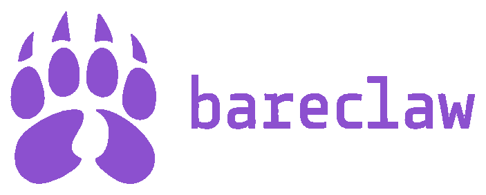

# bareclaw



A self-hosted AI agent platform that connects to multiple LLM providers through a unified interface: web chat UI, Telegram bot, HTTP webhooks, and scheduled cron jobs. Agents can autonomously run CLI commands in a restricted workspace.

## Features

- **Agents** — Define agents in YAML with their own model, system prompt, tools, and workspace
- **Cron jobs** — Schedule jobs that optionally run a command and feed the output to an agent for analysis
- **Webhooks** — Register HTTP POST endpoints for external services to trigger agent interactions
- **Telegram bot** — Chat with any agent via Telegram; receive cron notifications
- **Web UI** — Browser-based chat with streaming responses, plus dashboards for crons and webhooks
- **CLI tool calling** — Agents can autonomously run shell commands (restricted to their workspace)
- **Multi-provider LLM** — Pluggable provider system; run local models or connect to external APIs, per agent
- **Memories** — Persistent knowledge files that are keyword-matched and auto-injected into agent system prompts; agents can read and write them via tools
- **Superpowers** — Named external service bundles (config + secrets) keyword-injected into agent prompts; includes a bootstrap flow to auto-document APIs into memories

## Requirements

- Python 3.11+
- At least one configured LLM provider (e.g. a local [Ollama](https://ollama.com) instance)

## Setup

```bash
# 1. Install dependencies
pip install -r requirements.txt

# 2. Edit config
#    Set your api_key, Ollama URL, and optionally Telegram token
nano config.yaml

# 3. (Optional) Create a workspace directory for agent CLI execution
mkdir -p ~/workspace

# 4. Run
python main.py
```

Open http://localhost:8000 and log in with your API key.

## Configuration

### `config.yaml`

```yaml
ollama:
  base_url: http://localhost:11434

api_key: "changeme"        # Web UI + webhook auth

telegram:
  token: ""                # BotFather token
  allowed_user_ids: []     # Your Telegram numeric user ID

default_agent: default
```

### Config file conventions

Each config directory (`agents/`, `crons/`, `webhooks_config/`, `memories/`, `superpowers/`) contains an `example.yaml` that documents all available fields. These example files are:

- **Ignored at runtime** — never loaded as real agents, crons, or webhooks
- **The only YAML files committed to git** — your real configs are gitignored (as is `config.yaml`)

To add a real config, copy the relevant `example.yaml`, rename it, and fill in your values:

```bash
cp agents/example.yaml agents/my-agent.yaml
```

### Agents (`agents/*.yaml`)

```yaml
id: default
name: "Default Assistant"
provider: ollama           # LLM provider; more coming
model: llama3.2
ollama_base_url: ""        # Optional: override global ollama.base_url for this agent
system_prompt: |
  You are a helpful assistant.
temperature: 0.7
workspace: ~/workspace     # CLI commands confined here
tools:
  - run_command
  - read_file
max_iterations: 10
```

**Available tools:** `run_command`, `read_file`

### Cron jobs (`crons/*.yaml`)

```yaml
id: disk-check
schedule: "0 * * * *"     # Standard 5-field cron expression
agent: monitor
command: "df -h"           # Optional — output is prepended to the prompt
prompt: |
  Analyze the disk usage above and alert if any partition exceeds 80%.
notify_telegram: true
```

### Webhooks (`webhooks_config/*.yaml`)

```yaml
id: my-webhook
path: /webhooks/my-webhook
secret: ""                 # Optional HMAC-SHA256 secret (GitHub-style)
agent: default
prompt_template: |
  An event was received:
  {{ body }}
  Summarize what happened.
```

Call it:
```bash
curl -X POST http://localhost:8000/webhooks/my-webhook \
  -H "X-API-Key: changeme" \
  -H "Content-Type: application/json" \
  -d '{"event": "test"}'
```

### Memories (`memories/*.yaml`)

Persistent knowledge files agents can read and write. On each agent call, memories whose keywords match the conversation are automatically appended to the system prompt under `## Relevant memories`. No restart needed — files are loaded fresh each call.

```yaml
id: homeassistant-api
title: "Home Assistant API"
keywords:
  - homeassistant
  - home assistant
  - hass
content: |
  Base URL: http://homeassistant.local:8123
  ...
```

**Memory tools** (available to all agents, no YAML config needed):

| Tool | Description |
|---|---|
| `list_memories` | Returns id, title, and keywords for all memories |
| `read_memory(id)` | Returns the full content of one memory |
| `write_memory(id, title, keywords, content)` | Creates or overwrites a memory file |

### Superpowers (`superpowers/*.yaml` + `secrets/*.yaml`)

Named external service capabilities bundling config, secrets, and an optional bootstrap prompt. On each agent call, superpowers whose keywords match the conversation are automatically appended to the system prompt under `## Available superpowers`.

**`superpowers/<id>.yaml`** (safe to commit — no secrets):
```yaml
id: homeassistant
name: "Home Assistant"
description: "Local Home Assistant automation hub"
config:
  base_url: "http://homeassistant.local:8123"
keywords:
  - homeassistant
  - home assistant
  - lights
bootstrap_prompt: |
  Explore the Home Assistant API at {base_url} using Bearer {token}.
  Write a memory 'homeassistant-api' with your findings.
bootstrap_agent: default  # optional; defaults to app's default_agent
```

**`secrets/<id>.yaml`** (always gitignored — flat key/value; filename must match superpower id):
```yaml
token: "eyJhbGciOiJIUzI1NiIsInR5cCI6IkpXVCJ9..."
```

Consider `chmod 600 secrets/<id>.yaml`. Placeholders like `{token}` in `bootstrap_prompt` are interpolated from the merged config + secrets at bootstrap time.

**Superpower tools** (available to all agents, no YAML config needed):

| Tool | Description |
|---|---|
| `list_superpowers` | Returns id, name, description, and keywords for all superpowers |
| `read_superpower(id)` | Returns full config + secrets for the agent to use |

**Bootstrap**: clicking Bootstrap on the `/superpowers` page runs the configured agent with the interpolated `bootstrap_prompt`. The agent typically uses `run_command` (curl) and `write_memory` to document the external API into memories.

## Web UI Routes

| Route | Description |
|---|---|
| `GET /` | Chat interface |
| `GET /superpowers` | Superpower cards (config, secrets masked, bootstrap) |
| `GET /memories` | Memory browser |
| `GET /crons` | Cron job list + run history |
| `GET /webhooks` | Webhook list + call history |
| `WS /ws/chat?token=<key>` | WebSocket chat endpoint |

## Telegram Commands

| Command | Description |
|---|---|
| `/start` or `/help` | Show available commands |
| `/agents` | List configured agents |
| `/agent <id>` | Switch active agent |
| `/crons` | List cron jobs |
| `/clear` | Clear conversation history |
